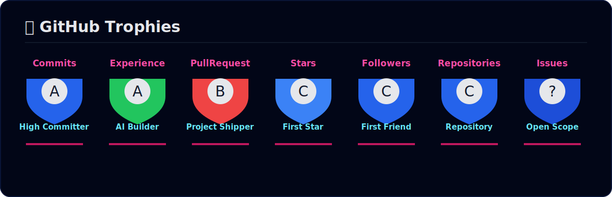

<p align="center">
  
</p>

<p align="center">
  <a href="https://git.io/typing-svg">
    
  </a>
</p>

<p align="center">
  
  
  
</p>

<p align="center">
  <a href="https://github.com/SarveshDhanrale25?tab=repositories"></a>
  <a href="https://linkedin.com/in/sarveshdhanrale"></a>
  <a href="mailto:sarveshdhanrale1@gmail.com"></a>
  <a href="https://github.com/SarveshDhanrale25"></a>
</p>

---

## About

Full Stack Developer and Generative AI Engineer building secure, production-minded web applications and AI-powered platforms. I work across React, Next.js, TypeScript, Node.js, Express, FastAPI, PostgreSQL, Prisma, Redis, Docker, RAG pipelines, LangChain, ChromaDB, LLM integrations, and machine learning workflows.

I care about clean APIs, authentication, RBAC, scalable backend architecture, polished dashboards, useful automation, and AI systems that solve real product problems.

---

## Tech Stack

**Languages**

<p>
  
</p>

**Frontend**

<p>
  
  
</p>

**Backend, Data & Infra**

<p>
  
</p>

---

## AI / ML Expertise

| Domain | Details |
|---|---|
| Generative AI | LLM integration, RAG pipelines, LangChain, ChromaDB, Groq, LLaMA workflows, prompt engineering |
| Machine Learning | EDA, preprocessing, feature engineering, Random Forest, AUC-ROC, F1, model optimization |
| Product AI | Automated reporting, AI agents, DevOps intelligence, legal-tech workflows, analytics automation |
| Data Science | Statistical analysis, visualization, insight extraction, model evaluation |

---

## Featured Projects

<details open>
<summary><strong>DigiRakshak - Privacy-First Identity Verification Platform</strong></summary>

| Area | Details |
|---|---|
| Stack | Next.js 15, TypeScript, Node.js, Express, PostgreSQL, Prisma, Redis, Docker, Tailwind CSS, Shadcn UI |
| Security | JWT access and refresh tokens, RBAC, replay protection, privacy-first verification model |
| Impact | Selective Aadhaar-linked attribute verification without exposing complete identity data |

Built multi-role citizen, merchant, and admin dashboards with a Controller-Service-Repository backend architecture.

</details>

<details>
<summary><strong>Nexus-Intel - AI DevOps Intelligence Platform</strong></summary>

| Area | Details |
|---|---|
| Stack | FastAPI, React, LLMs, ChromaDB, Machine Learning |
| AI | RAG pipeline over PR and sprint datasets for natural language querying |
| Impact | Improved risk prediction by approximately 28% and reduced reporting time by approximately 40% |

Built automated engineering analytics and model-based delivery risk intelligence.

</details>

<details>
<summary><strong>BugBot - AI Autonomous QA Agent</strong></summary>

| Area | Details |
|---|---|
| Stack | Python, LangChain, Groq API, Playwright |
| Focus | LLM-based root cause analysis and browser automation for QA workflows |
| Impact | Speeds up debugging and produces actionable failure context |

</details>

---

## Experience

### Full Stack Developer Intern - Lawable.in

Current

- Building an AI-powered legal-tech platform with React/Next.js, TypeScript, Node.js, Express, PostgreSQL, Prisma, and Redis.
- Implementing JWT authentication with refresh tokens and role-based access control.
- Working with Controller-Service-Repository backend architecture and performance-aware caching.

### Data Science Engineer Intern - YBI Foundation

May 2025 - June 2025

- Performed EDA and improved dataset consistency.
- Improved ML prediction accuracy by approximately 30% through preprocessing and feature engineering.
- Built data processing workflows to reduce manual effort.

---

## Achievements

| Recognition | Details |
|---|---|
| LOOP Hackathon, BVCOE | Finalist, Top 10 |
| PLUTONIUM Hackathon, VPPCOE | Finalist, Top 10 |
| R&D Committee, AI&DS | Secretary, coordinating research activities and AI/Data Science workshops |
| Data Pioneer Club | Treasurer, managed budgeting and event fund allocation |

---

## Certifications

<p>
  
  
</p>

---

## GitHub Analytics

<div align="center">

| Signal | Focus |
|---|---|
| Engineering | Full Stack Development + Generative AI |
| Core Stack | React, Next.js, TypeScript, Node.js, Express, PostgreSQL, Prisma |
| AI Work | RAG pipelines, LLM integration, LangChain, ChromaDB, AI agents |
| Product Work | Secure auth, RBAC, API design, caching, dashboards, automation |

</div>

---

## GitHub Trophies

<p align="center">
  
</p>

---

## Contribution Snake

<p align="center">
  <picture>
    <source media="(prefers-color-scheme: dark)" srcset="https://raw.githubusercontent.com/SarveshDhanrale25/SarveshDhanrale25/output/github-contribution-grid-snake-dark.svg" />
    <source media="(prefers-color-scheme: light)" srcset="https://raw.githubusercontent.com/SarveshDhanrale25/SarveshDhanrale25/output/github-contribution-grid-snake.svg" />
    
  </picture>
</p>

---

## Current Focus

```yaml
Learning:
  - Advanced system design for full-stack applications
  - Production-grade RAG pipelines and AI agents
  - Secure authentication and authorization patterns
Building:
  - AI-powered legal-tech workflows at Lawable.in
  - Privacy-first identity verification with DigiRakshak
  - DevOps intelligence and automated engineering analytics
Open_To:
  - Full Stack Developer Internships
  - AI / ML Engineering Internships
  - Generative AI Projects
  - Open Source Collaboration
```

---

<p align="center">
  <a href="mailto:sarveshdhanrale1@gmail.com"></a>
  <a href="https://linkedin.com/in/sarveshdhanrale"></a>
  <a href="https://github.com/SarveshDhanrale25"></a>
</p>

<p align="center">
  <strong>Engineering useful systems with clean software, practical AI, and measurable impact.</strong>
</p>

<p align="center">
  
</p>
